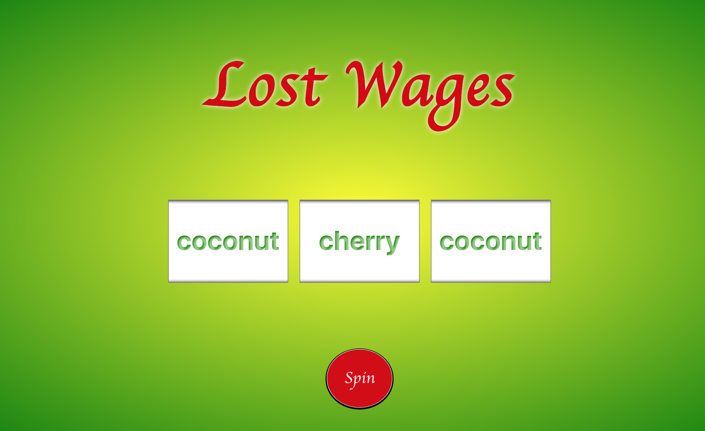

## React Slot Machine

#### Introduction

**Title**: React Slot Machine

This project focus is to build a slot machine using React components.

***The goal*** of the project is to build a slot machine using React; each reel extracts content from a short array that is looped through in-order.  The first slot reel was built with jQuery and CSS then refactored into React components, after which slot 2 and slot 3 were added. All reels are monitored in State keeping track of number-of-spins which, with the help of Math.random functions, helps to determine when each reel successively stops: reel1, reel2, then reel3.

##### Start-up Server

To run the server, NPM or Yarn must be installed.

Open up the terminal and go to the project directory.  Inside of the project directory, run:

`npm install`

`npm start`

If you have Yarn installed run:

`yarn start`

This project was built using *Create React App*.  For complete technical details click [Create React App](./docs/README.md)

##### Technical Components
- Flexbox  
- Media queries used to build the *responsive design*.
- JavaScript (ECMASript 6)
- React 16.5.2
- Accessibility-ready

##### Articles and Tutorials
<!-- [Based on this javascript lesson at Code Academy but expanded to React for practice.](https://www.codecademy.com/learn/introduction-to-javascript) -->

#### Picture of React Component Map
<!--  -->

#### Pictures of Responsive Design
##### Phone

<!--  -->

##### Tablet
<!--  -->

##### Desktop
<!--  -->

#### Planning and Workflow
1. Develop first static reel
 * make static HTML page for basic design
    * Use HTML input to get Kelvin temperature

    * Render equation results in a sentence along with image matching the temperature result.
2. Add jQuery to "spin" through the array with results showing on DOM.
<!-- 3. break UI into React components --> 
<!-- [See component map above](#picture-of-react-component-map) -->
